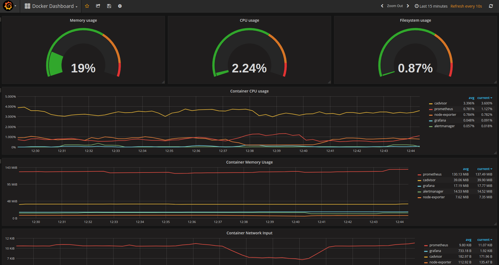
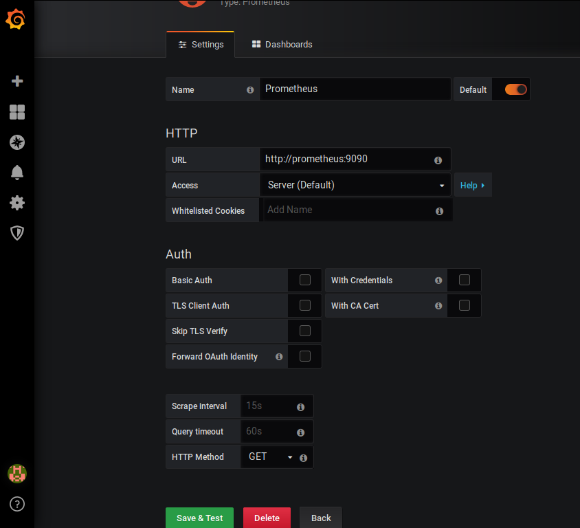
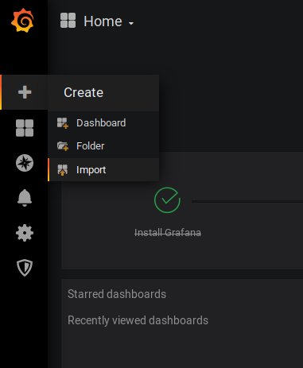
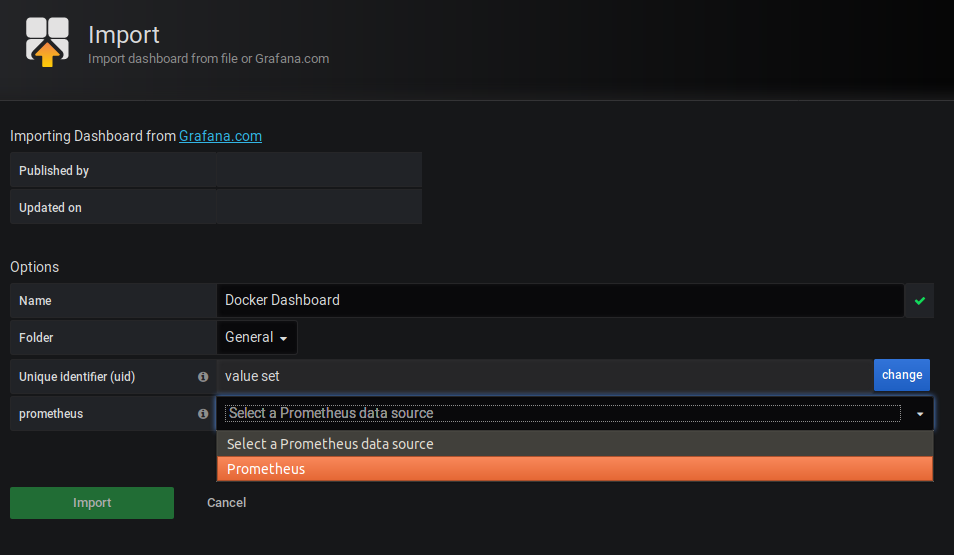

# Contents

- [Overview](#a-prometheus--grafana-demo)
- [Pre-requisites](#pre-requisites)
- [Installation & Configuration](#installation--configuration)
  - [Post Configuration](#post-configuration)
  - [Import Dashboard](#import-dashboard)
  - [Alerting](#alerting)
  - [Test Alerts](#test-alerts)
    - [Service Down](#service-down)
    - [High Load](#high-load)
- [Security Considerations](#security-considerations)
- [Troubleshooting](#troubleshooting)
  - [Mac Users](#mac-users)

# A Prometheus & Grafana demo
Here's a quick start tutorial using only docker and docker-compose to start-up a [Prometheus](http://prometheus.io/) demo on your local machine containing Prometheus, Grafana, cadvisor and node-exporter to monitor your Docker infrastructure and machine.

Prometheus and Grafana is a strong combo which can be used to monitor other things such as Kubernetes.
If you want to know how to monitor Kubernetes and workloads with Prometheus take a look at [Digital Oceans tutorial](https://www.digitalocean.com/community/tutorials/how-to-set-up-a-prometheus-grafana-and-alertmanager-monitoring-stack-on-digitalocean-kubernetes).

# Pre-requisites
Before we get started setting up the Prometheus demo ensure you install the latest version of [docker](https://docs.docker.com/install/) and [docker-compose](https://docs.docker.com/compose/install/) on your machine.

Currently the repo requires 18.06.0+ version of docker and 1.25.0+ of docker-compose as it uses version 3.7 of the compose file format.

You can check your versions by running `docker --version` and `docker-compose --version`

# Installation & Configuration
Clone this project locally to your machine.

If you would like to change which targets should be monitored or make configuration changes edit the `prometheus.yml` file. 
The targets section is where you define what should be monitored by Prometheus. The names defined in this file are sourced from the service name in the docker-compose file. If you wish to change names of the services you can add the "container_name" parameter in the `docker-compose.yml` file.

This project has sensible defaults meaning that you can just go ahead and start it up by running the following command:

    $ docker-compose up -d

The above command will collect the latest docker images of the projects used in this repo.

See what containers was started by running

    $ docker ps

Grafana is now accessible via: `http://localhost:3000`

	username - admin
	password - foobar (Password is stored in the `config.monitoring` env file)

## Post Configuration
Now we need to create the Prometheus Datasource in order to connect Grafana to Prometheus 
* Click the `Gear` menu icon in the left side menu
* Click `Add data source`
* Fill the `URL` input box with `http://prometheus:9090`
* Click `Save and Test`.

## Import Dashboard
There are Dashboard templates included in this demo within the `dashboard` folder, to use them you can import them into grafana.

Follow the step by step guide and use the images below it as a guide:

* Click the `Plus sign` menu icon in the left side menu
* Click `Import`
* Click `Upload .json file`
* Navigate to the `dashboards` folder and select a .json file to upload e.g. `docker.json`
* In the prometheus selection box select `Prometheus`
* Click import

The dashboards are intended to help you get started with monitoring using Prometheus.
There are different dashboards included in this tutorial:

* Docker Dashboard based on cadvisor data - `dashboards/docker.json`
* Alerting Dashboard - `dashboards/high-load-dashboard.json`
* Prometheus 2 Dashboard - `dashboards/high-load-dashboard.json`
* System monitoring Dashboard based on node exporter - `dashboards/system-monitoring.json`

## Alerting
Alerting has been added to the stack with Slack integration. 
Two Alerts have been pre-configured and can by seen in:

Alerts              - `prometheus/alert.rules`
Slack configuration - `alertmanager/config.yml`

The Slack configuration requires to build a custom integration.
* Open your slack team in your browser `https://<your-slack-team>.slack.com/apps`
* Click build in the upper right corner
* Choose Incoming Web Hooks link under Send Messages
* Click on the "incoming webhook integration" link
* Select which channel
* Click on Add Incoming WebHooks integration
* Copy the Webhook URL into the `alertmanager/config.yml` URL section
* Fill in Slack username and channel

View Prometheus alerts `http://localhost:9090/alerts`  
View Alert Manager `http://localhost:9093`  

### Test Alerts

#### Service Down
A quick way to test the service down pre-configured alert is to stop a service. 

* Stop the `node-exporter` container by running `docker stop node_exporter`.
* Check the alerts in both the Alert Manager `http://localhost:9093` and Prometheus Alerts `http://localhost:9090/alerts` to understand how they flow through the system and what you can control where.
* The alert will start by being `pending` which can only be seen in Prometheus Alerts `http://localhost:9090/alerts`.
* This is because Prometheus will only sent the alert to Alert Manager `http://localhost:9093` when it is `active`, which in this case will take 2 minutes due to the configuration in `prometheus/alert.rules`.
* You should notice shortly the alert arrive in Slack if you have configured the integration. 
* To make everything go back to normal run `docker-compose up -d`.

#### High Load
This tutorial has a bash file to help testing high load. You can look trough it first to see what it, the short version is that it runs a busy loop on all your CPUs.

* To test the high load alert run `./alert.sh`.
* Let this run for a few minutes and you will notice the load alert appear. 
* Then press `any key` or `Ctrl+C` to cancel the script.

# Security Considerations
This project is intended to be a quick-start to get up and running with Docker and Prometheus. Security has not been implemented in this project. It is the users responsability to implement sensible security practices.

# Troubleshooting
It appears some people have reported no data appearing in Grafana. If this is happening to you be sure to check the time range being queried within Grafana to ensure it is using Today's date with current time.

## Reset
If you want to get a clean start you can do a reset of this demo.
To do a complete reset run `./reset.sh`.
This will delete everything created by this demo including the volumes holding persistent data.

## Mac Users
The node-exporter does not run the same as Mac and Linux. Node-Exporter is not designed to run on Mac and in fact cannot collect metrics from the Mac OS due to the differences between Mac and Linux OS's. I recommend you comment out the node-exporter section in the `docker-compose.yml` file and instead just use the cAdvisor. 